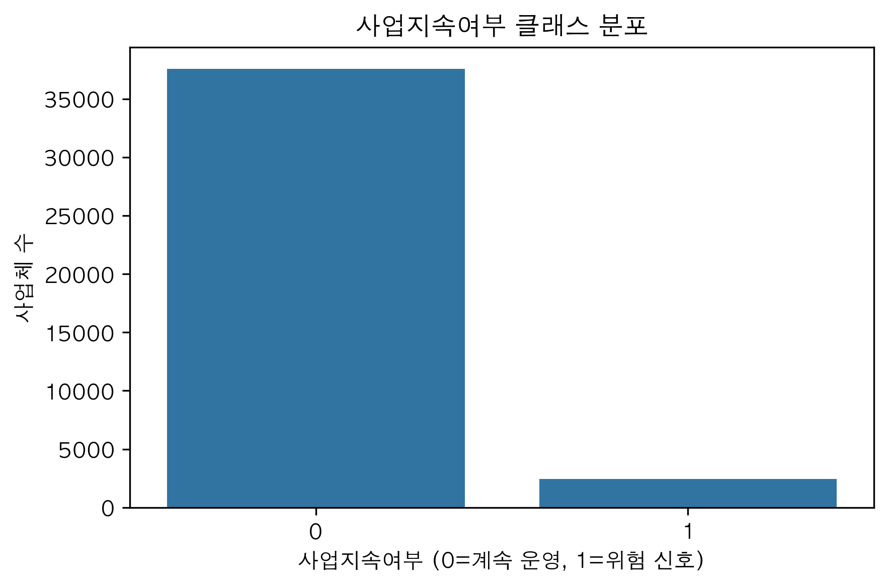
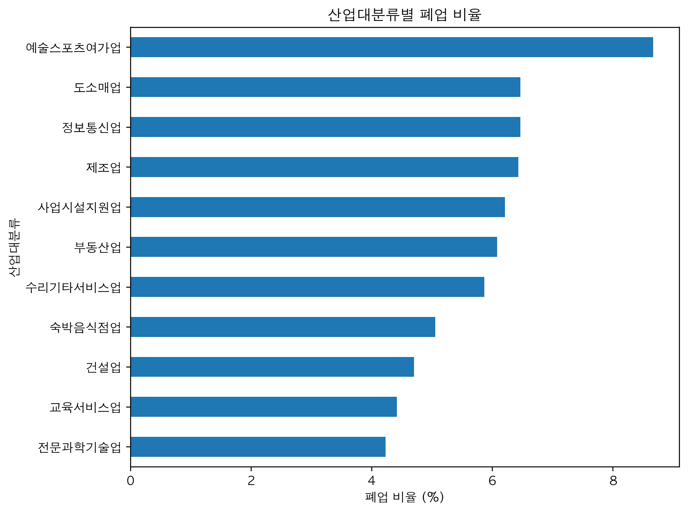
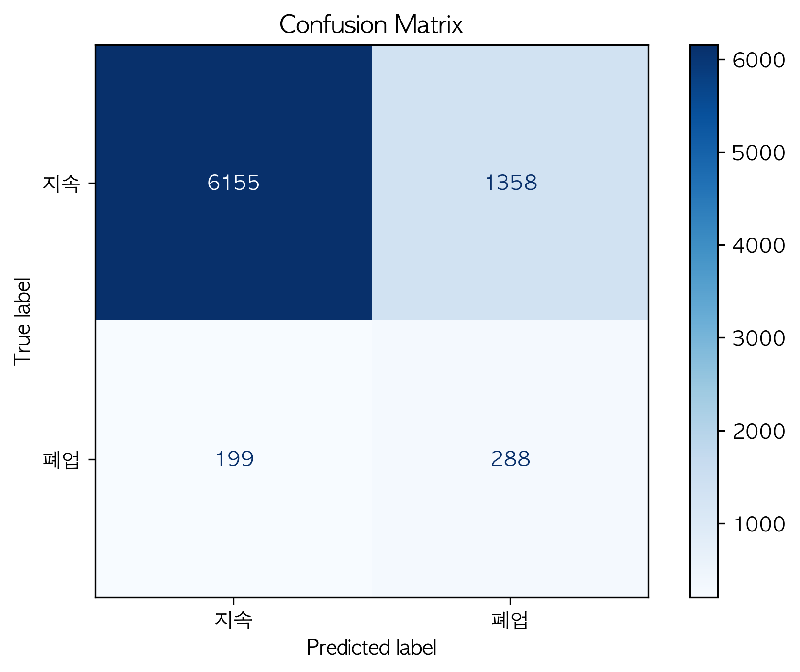
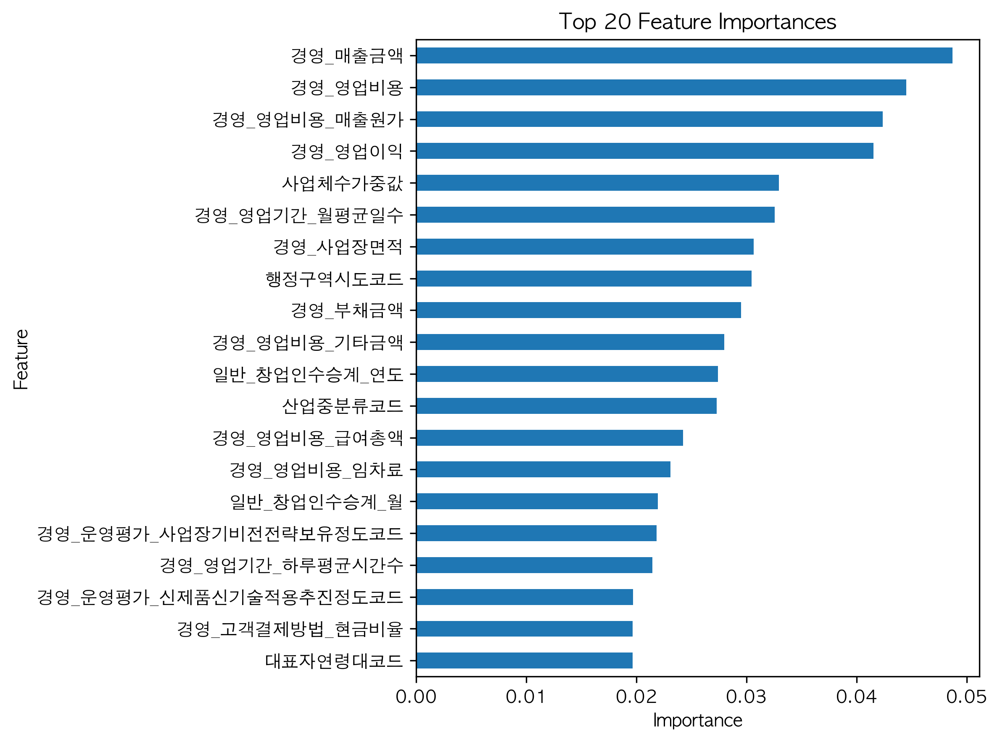
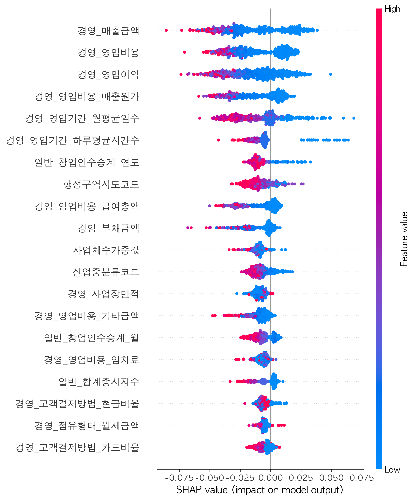

# 소상공인 폐업 위험 신호 예측

> 2023년 MDIS 소상공인 실태조사 데이터를 활용해, 소상공인의 **사업 지속 위험 신호를 조기에 탐지**한 머신러닝 프로젝트입니다.

## 프로젝트 한눈에 보기

- **주제**: 소상공인 폐업 위험 신호 예측
- **데이터**: MDIS 2023 소상공인 실태조사 연간자료_등록기반
- **분석 대상**: 40,000개 사업체
- **모델**: Random Forest
- **핵심 성과**: Test ROC-AUC 0.792, Test F1-score 0.270
- **핵심 키워드**: 머신러닝, 불균형 데이터, 피처 엔지니어링, 정책 시사점, SHAP

---

## 프로젝트 소개

소상공인의 폐업은 개인의 생계 문제를 넘어 고용, 지역 상권, 정책 설계와도 연결됩니다.  
이 프로젝트는 단순히 폐업 여부를 사후적으로 설명하는 데 그치지 않고, **사업 지속 의향이 약화되는 위험 신호를 조기에 포착**하는 데 초점을 두었습니다.

특히 설문 기반 데이터를 활용해, 어떤 사업체가 위험군에 가까운지 예측하고, 그에 영향을 주는 핵심 요인을 함께 해석했습니다.

---

## 문제 정의

- 소상공인 폐업은 사후 대응보다 **사전 위험군 탐지**가 중요함
- 실제 현장에서는 폐업이 확정되기 전 단계에서 위험 신호를 포착하는 것이 더 유의미함
- 따라서 본 프로젝트에서는 단순한 폐업 여부 대신, **사업전환·폐업·은퇴 계획을 포함한 사업 지속 위험 신호**를 타깃으로 설정함

---

## 데이터

- **출처**: MDIS 「소상공인 실태조사 연간자료_등록기반」 (2023)
- **원변수 수**: 156개
- **최종 사용 변수 수**: 118개
- **분석 대상 수**: 40,000개 사업체

### 타깃 변수 정의
- `0`: 계속 운영
- `1`: 사업전환 / 폐업 / 은퇴 계획

즉, 이 프로젝트는 **실제 폐업 여부 판별 모델**보다, **사업 지속 위험 신호 탐지 모델**에 가깝습니다.

---

## 수행 작업

### 1) 데이터 전처리
- 결측치 처리
- 불필요 변수 제거
- 데이터 누수 가능 변수 제거
- 상수 및 문자열 변수 제거
- 코드형 변수 0/1 재정의

### 2) 피처 엔지니어링
- 해석이 어려운 변수명을 의미 중심으로 재정리
- 정책 관련 변수를 분리하여 파생변수 생성
- 타깃 변수 재정의

### 3) 탐색적 데이터 분석
- 업종별 분포 확인
- 업종별 폐업 비율 확인
- 지역 분포 확인
- 수치형 변수 상관관계 탐색
- 클래스 불균형 확인

### 4) 모델링 및 평가
- Baseline / Undersampling / SMOTE 기반 Random Forest 비교
- RandomizedSearchCV 기반 하이퍼파라미터 튜닝
- threshold 조정 실험
- ROC-AUC, Recall, F1-score 중심 평가

### 5) 결과 해석
- Confusion Matrix 확인
- Feature Importance 분석
- SHAP 기반 중요 변수 해석
- 정책적 시사점 정리

---

## 분석 과정

```text
데이터 이해
→ 결측치 및 변수 구조 정리
→ 피처 엔지니어링
→ EDA
→ Random Forest 기반 모델 비교
→ 하이퍼파라미터 튜닝
→ threshold 조정
→ 성능 평가
→ SHAP / 변수 중요도 해석
→ 정책 시사점 도출
```

---

## 모델링

### 사용 모델
- RandomForestClassifier

### 데이터 분할
- Train / Validation / Test = 60 / 20 / 20
- Stratified split 적용

### 비교한 접근
- Baseline Random Forest
- Undersampling Random Forest
- SMOTE Random Forest
- Tuned Random Forest

### 최종 선택
- **Tuned Random Forest + threshold 0.3**

---

## 주요 결과

### 성능
- **Test ROC-AUC**: 0.792
- **Test F1-score**: 0.270

### 주요 변수
- 매출
- 영업비용
- 영업이익
- 매출원가
- 부채
- 임차 관련 비용
- 영업기간
- 업종
- 지역
- 운영역량 평가 지표

### 결과 해석
- 불균형 데이터에서는 accuracy보다 **소수 클래스 탐지력**이 중요함
- 재무 변수뿐 아니라 운영 구조, 입지, 정책 접근성도 함께 중요하게 작용함
- 이 모델은 "폐업 확정 예측"보다 **위험 신호 조기 탐지**에 더 적합함

---

## 시각화 결과

아래 시각화는 이후 순차적으로 정리해 추가할 예정입니다.

### 1. 클래스 불균형 분포


### 2. 업종별 폐업 비율


### 3. Confusion Matrix


### 4. Feature Importance Top 20


### 5. SHAP Summary Plot


---

## 정책적 시사점

- 소상공인 지원은 사후 지원보다 사전 위험군 식별이 중요할 수 있음
- 재무 취약성뿐 아니라 운영 구조와 정책 접근성까지 함께 고려해야 함
- 데이터 기반으로 정책 우선순위를 설계할 수 있는 가능성을 보여줌

---

## 기술 스택

- **Language**: Python
- **Libraries**: pandas, numpy, scikit-learn, matplotlib, seaborn, shap
- **Modeling**: Random Forest, RandomizedSearchCV
- **Analysis**: EDA, Feature Engineering, Threshold Tuning, SHAP

---

## 저장소 구조

```bash
small-business-closure-risk-prediction/
├─ README.md
├─ notebooks/
│  └─ small_business_risk_prediction.ipynb
├─ src/
│  └─ README.md
├─ images/
│  └─ README.md
├─ data/
│  ├─ README.md
│  └─ sample/
│     └─ sample_data.csv
├─ requirements.txt
```

---

## 실행 환경

```bash
pip install -r requirements.txt
```

이후 Jupyter Notebook에서 `notebooks/small_business_risk_prediction.ipynb` 파일을 열어 분석 과정을 확인할 수 있습니다.

---

## 데이터 안내

이 저장소에는 **원본 전체 데이터가 아닌 샘플 데이터만 포함**되어 있습니다.

원본 데이터는 MDIS에서 제공받아 활용했으며, 현재 저장소에는 구조 확인 및 분석 흐름 이해를 위한 최소 구성만 포함했습니다.

---

## 개선 아이디어

- README에 실제 결과 이미지 삽입
- XGBoost, LightGBM 등과의 성능 비교
- 위험 신호 정의를 더 정교하게 조정
- 노트북 코드를 `src/`로 일부 분리

---

## 한 줄 요약

**소상공인의 사업 지속 위험 신호를 조기에 탐지하고, 이를 정책적 개입 가능성과 연결해 해석한 머신러닝 프로젝트**
